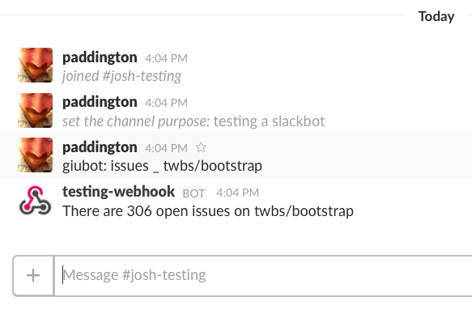

Trying to get the example from https://www.sitepoint.com/building-a-slackbot-with-ruby-and-sinatra/ working

Create a heroku app:

```sh
$ heroku apps:create slackbot-example
Creating ⬢ slackbot-example... done
https://slackbot-example.herokuapp.com/ | https://git.heroku.com/slackbot-example.git
```

Then push it

```sh
$ git push slackbot-example master:master
```

Test it with curl (dummy data)

```sh
$ curl -i https://slackbot-example.herokuapp.com/gateway -d token=eExRyKtmi3TPoZJM6NcbELvm -d team_id=T0001 -d team_domain=example -d channel_id=C2147483705 -d channel_name=test -d timestamp=1355517523.000005 -d user_id=U2147483697 -d user_name=Steve -d 'text=giubot: issues _ twbs/bootstrap' -d 'trigger_word=giubot:'
```

Make a slack webhook [here](https://slack.com/services/new/outgoing-webhook).


